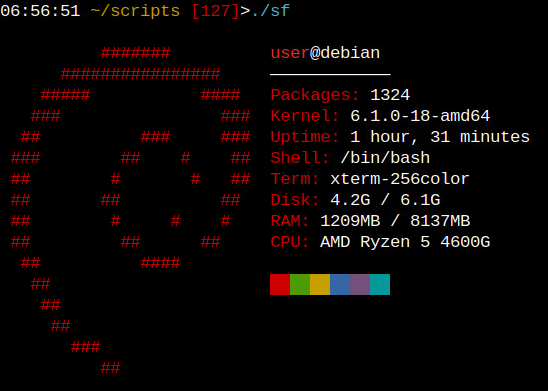

# simplefetch

## installation

1. git clone https://github.com/clydeconfigs/simplefetch
2. cd simplefetch
3.  ``make``

## support

currently only supported for
- arch
- debian
- void
- nix

other distros don't matter so not bothering
